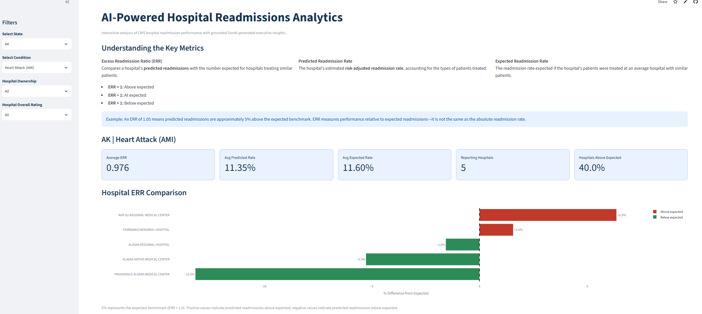
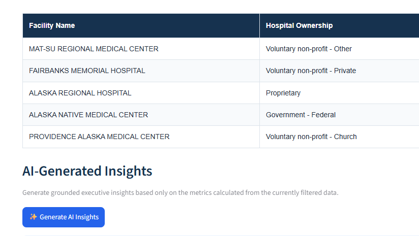

# AI-Powered Hospital Readmissions Analytics

An interactive healthcare analytics project using CMS hospital readmission data, Python, Streamlit, Plotly, and GenAI.

## Live Demo

[Launch the Streamlit App](https://healthcarereadmissionsai-f3ckvbyktui2rtwpdzlflg.streamlit.app/)

### App Preview




## Project Objective

The goal of this project is to analyze hospital readmission performance and use GenAI to convert verified analytical outputs into concise executive insights.

The project combines:

- CMS Hospital Readmissions Reduction Program (HRRP) data
- CMS Hospital General Information
- Python-based data cleaning and analysis
- Interactive Streamlit visualizations
- Grounded AI-generated insights using the OpenAI API

## Business Questions

The analysis explores questions such as:

- Which conditions have the highest Excess Readmission Ratios (ERR)?
- Which states show higher readmission performance relative to expected benchmarks?
- Which hospitals have elevated ERR values?
- How does ERR vary across hospital ratings?
- How does ERR differ across hospital ownership groups?
- Are higher-rated hospitals associated with lower readmission ratios?
- Can GenAI summarize verified metrics without introducing unsupported conclusions?

## Data Sources

The project uses publicly available CMS hospital datasets:

1. Hospital Readmissions Reduction Program (HRRP)
2. Hospital General Information

The datasets were joined using `Facility ID`.

## Key Metric: Excess Readmission Ratio

The Excess Readmission Ratio (ERR) compares a hospital's predicted readmission rate with its expected readmission rate.

- `ERR > 1` → predicted readmissions are above expected
- `ERR < 1` → predicted readmissions are below expected
- `ERR = 1` → predicted readmissions are approximately equal to expected

For interpretability, the Streamlit application converts ERR into percentage difference from expected.

Example:

- `ERR = 1.05` → approximately 5% above expected
- `ERR = 0.95` → approximately 5% below expected

## Key Findings

- Hip/Knee Replacement had the highest average ERR across the six HRRP conditions analyzed, although the average was only slightly above the expected benchmark.
- Massachusetts had the highest average state-level ERR in the analysis.
- Within Massachusetts AMI, approximately 69.7% of hospitals with reported ERR values were above their expected benchmark.
- Hospitals with higher absolute readmission rates did not necessarily have higher ERR because ERR measures performance relative to a risk-adjusted expected benchmark.
- Proprietary hospitals showed average ERR above 1 across all six HRRP conditions in the analyzed data.
- Hospital overall rating showed a clear inverse association with ERR, with higher-rated hospitals generally showing lower average ERR.
These findings represent associations and should not be interpreted as causal relationships.

## Streamlit Application

The interactive application allows users to filter by:
- State
- Clinical condition
- Hospital ownership
- Hospital overall rating
The application displays:
- Average ERR
- Average predicted readmission rate
- Average expected readmission rate
- Number of reporting hospitals
- Percentage of hospitals above expected
- Hospital-level ERR comparison
- ERR by hospital rating
- ERR by hospital ownership
- AI-generated executive insights

## GenAI Approach

All numerical metrics are calculated in Python before they are sent to the language model.
The AI receives only verified analytical outputs generated from the filtered data.
The prompt is designed to:
- use only supplied metrics
- avoid inventing clinical explanations
- avoid unsupported statistics
- distinguish observed findings from interpretation
- distinguish absolute readmission rates from ERR
- treat ownership and rating results as associations rather than causal effects
- acknowledge sample-size and data limitations
The AI is therefore used as an interpretation layer, not as the source of analytical facts.


## AI Output Validation

AI-generated outputs were reviewed against the verified Python metrics.
Validation included:
- checking ERR calculations and percentage interpretations
- confirming absolute readmission rates were not confused with ERR
- checking that unsupported clinical causes were not introduced
- confirming ownership and rating findings were described as associations
- reviewing sample-size limitations
- comparing manual ChatGPT output with API-generated output
The main findings were consistent across both approaches.


## Tools and Technologies
- Python
- pandas
- Google Colab
- Streamlit
- Plotly
- OpenAI API
- JSON
- GitHub

## Important Limitations

- Results apply only to hospitals with reported CMS data.
- Missing or suppressed CMS values reduce the number of hospitals available for some analyses.
- Some ownership groups contain small numbers of hospitals and should be interpreted cautiously.
- Associations between hospital characteristics and ERR do not establish causality.
- Hospital rating, ownership, geography, patient population, service mix, and other unmeasured characteristics may be related to observed patterns.
- ERR should not be interpreted as a complete measure of overall hospital quality.
- AI-generated insights should not be treated as an independent source of facts.


## Future Enhancements

Potential extensions include:
- multi-year HRRP analysis
- trend analysis across reporting periods
- richer hospital benchmarking
- downloadable reports
- expanded GenAI follow-up analysis

## Analytical Workflow

```text
CMS HRRP Data
        +
CMS Hospital General Information
        ↓
Data Cleaning and Validation
        ↓
Python Analysis
        ↓
Verified Analytical Metrics
        ↓
Interactive Streamlit Dashboard
        ↓
Structured GenAI Prompt
        ↓
OpenAI API
        ↓
AI-Generated Executive Insights
        ↓
Human Validation